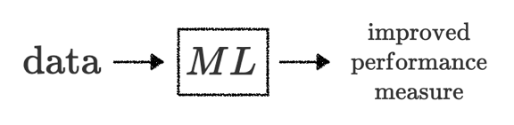
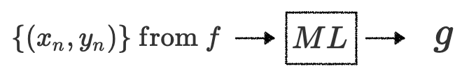
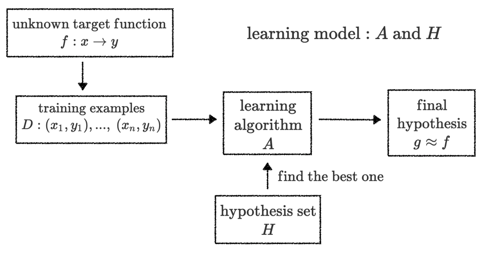

### The Learning Problem

- Key essense of ML
  1. exist some "underlying pattern" to be learned
  2. no (easy) programmable definiton
  3. somehow there is data about the pattern

- Formalize the Learning Problem

  

  1. input: $\mathrm{x} \in x$ 
  2. output: $\mathrm{y} \in y$ 
  3. $f: x \rightarrow y$
     - $f$ is the target function
     - $f$ is unknown and ideal
  4. data: training examples
     $$D = \{(x_1, y_1), (x_2, y_2), ..., (x_n, y_n)\}$$
  5. hypothesis: skill with hopefully good performance
     $$g: x \rightarrow y$$
     - $g$ is hopefully approximately equal to $f$, but they can't be same, because $f$ is unknown
  

- Practical Definition of ML

  

  1. use data to compute hypothesis $g$ that approximates $f$

- Compare
  | Term | definition|
  | ---- | ---- | 
  | Machine Learning | use data to compute hypothesis $g$ that approximates $f$ | 
  | Data Mining | use (huge) data to find property that is interesting |
  | AI | compute something that shows intelligent behavior |
  | Statistics | use data to make inference about an unknown process |

  1. if "interesting thing" same as "hypothesis that approximates target"
  $$ML = DM$$
  2. if "interesting thing" related to "hypothesis that approximates target"
  $$ML \mathrm{\ helps\ } DM \mathrm{,\ and\ vice\ versa}$$
  3. data mining more focuses on efficient computation in large database
  4. $g \approx f$ shows intelligence
     $$ML \mathrm{\ can\ realize,\ among\ other\ routes\ } AI$$
  5. $g$ is an inference outcome, $f$ is something unknown
     $$Statistics \mathrm{\ can\ be\ used\ to\ achieve\ } ML$$
     

