### 機率

- Probability Model
  - Experiment
    1. Procedure: 過程（丟出一個四面骰）
    2. model: 模型（激似分佈）
    3. outcome: 結果
  - Principle of Indifference: 任何outcome機率視為相等，因為沒有理由說明其中之一較大
  - Sample space $\Omega$: 所有outcome的集合
    1. Countably infinite: 可以跟正整數一一對應
  - Event: 
    1. outcome的集合
    2. sample space的子集
- Set Operation
  - 名詞解釋
    1. Universal set $\Omega$: 對應sample case
    2. Element: 對應outcome
    3. Subset: 對應event
    4. Empty set $\text{\O}$
    5. Complement $S^c$
    6. Union $S \cup T$
    7. Intersection $S \cap T$
    8. Difference $S - T$
    9. Disjoint: $S \cap T = \text{\O}$
    10. Mutually exclusive: $S_i \cap S_j = \text{\O},\ for\ any\ i,\ j,\ i \neq j$
  - 公式
    1. $\cap_{n = 1}^{\infty} \cup_{k = n}^{\infty} = \{x: x \in S_k,\ for\ some\ k \geq n,\ infinite\ many\}$
    2. $\cup_{n = 1}^{\infty} \cap_{k = n}^{\infty} = \{x: x \in S_k,\ for\ all\ k \geq n,\ finite\ many\}$
  - De Morgan's Law:
    1. 集合取complement，交聯集相反
    2. 文士圖證明
- 3 Axiom
  - $P(A) \geq 0$
  - $P(\Omega) = 1$
  - $A_1,\ A_2, ...$ are mutually exclusive
    $P(\cup_{i = 1}^{\infty} A_i) = \Sigma_{i = 1}^{\infty} P(A_i)$
  - 練習
    1. 證明$P(\Omega) = 0$
    2. $A_1,\ A_2, ...$ are mutually exclusive，$P(\cup_{i = 1}^{n} A_i)$為何？
    3. 證明$P(A) \leq 1$
- Discrete Uniform Probability Law
  - 如果$\Omega$有$N$個element發生可能性相同，那麼所有事件機率為
    $P(A) = \frac {Number\ of\ elements\ in\ A} {N}$
- Continuiity of Functions
  - continuous: $f: R \rightarrow R$連續 iff for every convergent sequence $\{x_n\}_{n = 1}^{\infty}$，$\lim_{n \rightarrow \infty} f(x_n) = f(x)$
  - 連續機率上單點值機率為0
    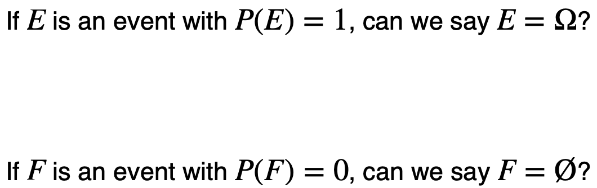
- Increasing events
  - Increasing: $E_1 \subseteq E_2 \subseteq E_3 ... \subseteq E_n \subseteq ...$
  - 可作limit interchange: $\lim_{n \rightarrow \infty} P(E_n) = P(\lim_{n \rightarrow \infty} E_n)$
  - 拆分disjoint證明，套用axiom #3
  - decreasing有同樣特性
- 機率為0
  - Improbable: $P(E) = 0$
  - Impossible: $E = \text{\O}$
- 條件機率
  - $P(A|B) = \frac {P(A \cap B)} {P(B)}$
  - Reduction of Sample Space
    $P(B) > 0$
    1. $P(A|B) \geq 0$
    2. $P(\Omega |B) = 1$
    3. $A_1,\ A_2, ...$ are mutually exclusive
       $P(\cup_{i = 1}^{\infty} A_i|B) = \Sigma_{i = 1}^{\infty} P(A_i|B)$
  - Multiplication Rule
    1. 假設所有條件機率皆大於0
       $P(\cap_{i = 1}^n A_i) = P(A_1)P(A_2|A_1)...P(A_n|A_1 \cap A_2 \cap ... \cap A_{n - 1})$
  - Total Probability Theorem
    1. $A_1,\ A_2, ...$ are mutually exclusive, which form $\Omega$
    2. $P(A_i) > 0$
    3. $P(B) = P(A_1 \cap B) + ... + P(A_n \cap B)$
  - Bayer's Rule
    1. $A_1,\ A_2, ...$ are mutually exclusive, which form $\Omega$
    2. $P(A_i) > 0$
    3. $P(A_i|B) = \frac {P(A_i)P(B|A_i)} {P(B)}$
  - 練習
    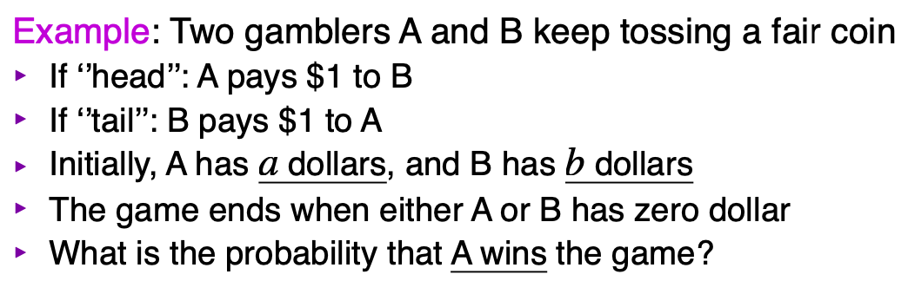
    設$P(n)$為A有n元時贏的機率，轉移可推出機率為等差數列
- Independence 獨立
  - 兩事件獨立
    1. 兩事件獨立，if $P(A)P(B) = P(A \cap B)$
    2. if $P(A) > 0$, $P(A|B) = P(A)$
    3. 證明$A$, $B^c$獨立
  - 多事件獨立
    1. $P(\cap_{i \in S} A_i) = \prod_{i \in S} P(A_i),\ for\ every\ S \subseteq {1, 2, ..., n}$
- Combinatorial Methods
  - Permutation 排列
    1. 有順序關係
    2. $P_k^n = \frac {n!} {(n - k)!}$
  - Combination 組合
    1. 無順序關係
    2. $C_k^n = \frac {n!} {(n - k)!k!}$
  - 衝突問題
    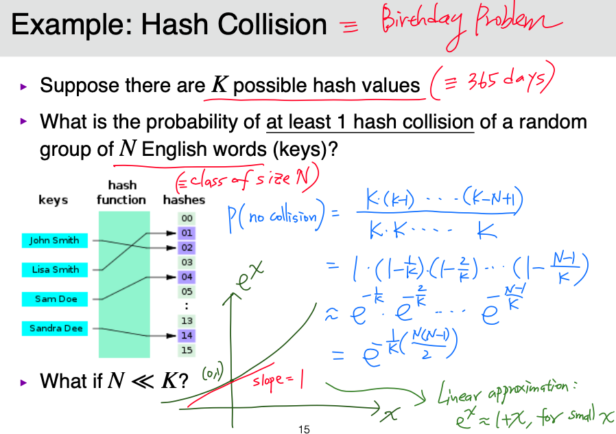
  - Binomial Expansion 二項式定理
    1. $(x + y)^n, n \geq 0$
    2. 可寫成$\Sigma_{i = 0}^n C_i^n x^i y^{n - i}$
  - Multinomial Expansion
    1. $(x_1 + x_2 + ... + x_k)^n, n \geq 0$
    2. $x_1^{n_1} + x_2^{n_2} + ... + x_k^{n_k}$的係數為$\frac {n!} {n_1!n_2!...n_k!}$
- Random Variables
  - function將每個outcome對到$R$
    1. Discrete random variables: CDF or PMF
    2. Continuous random variables: CDF or PDF
  - Cumulative Distribution Function (CDF)
    1. 對任意r.v. x，其CDF為
       $F_x(t) = P(x \leq t),\ for\ all\ t \in R$
    2. $F_x(t)$ non-decreasing
    3. $\lim_{t \rightarrow \infty} F_x(t) = 1$
    4. $\lim_{t \rightarrow -\infty} F_x(t) = 0$
    5. $F_x(t)$右連續，$F_x(t^+) = F_x(t)$

    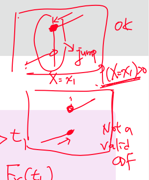
  
  - Probability Mass Function (PMF)
    1. 對任意離散r.v X with {x_1, x_2, ...}，可作PMF
    2. $p(x_i) = P(X = x_i)$
    3. $p(x) = 0,\ if\ x \notin {x_1, x_2, ...}$
    4. $\Sigma_{i = 1}^{\infty} p(x_i) = 1$
  
  - 對離散r.v.而言，CDF和PMF等價
  - 特殊離散隨機變數
    1. Bernoulli r.v: 只有兩種outcome
       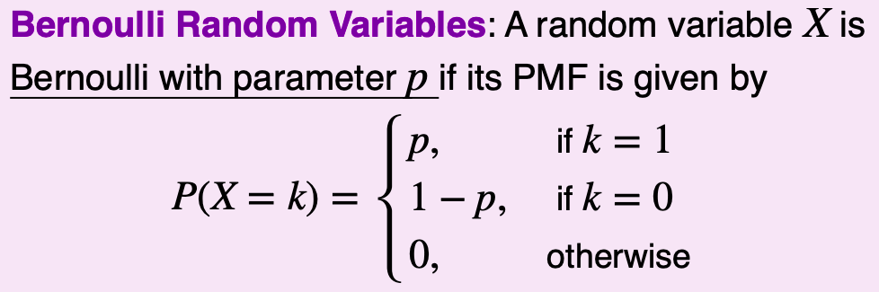
    2. Binomail r.v: n次Bernoulli，求幾次成功機率
       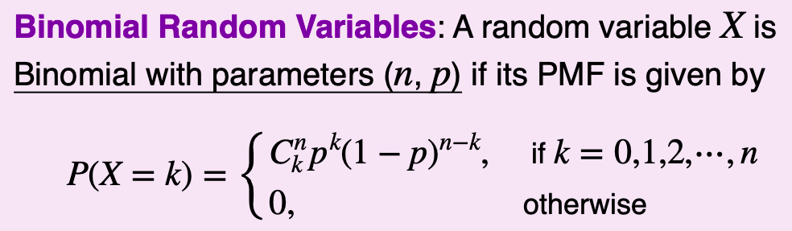
       - 可用二項式定理證明，$\Sigma_{k = 0}^n P(X = k) = 1$
       - 當$n \rightarrow \infty$，$X ~ Binomial(n, p = 0.5)$符合central limit therom
    3. Poisson r.v.: 已知時間$T$中平均成功$\lambda$次，求一段時間成功若干次的機率
       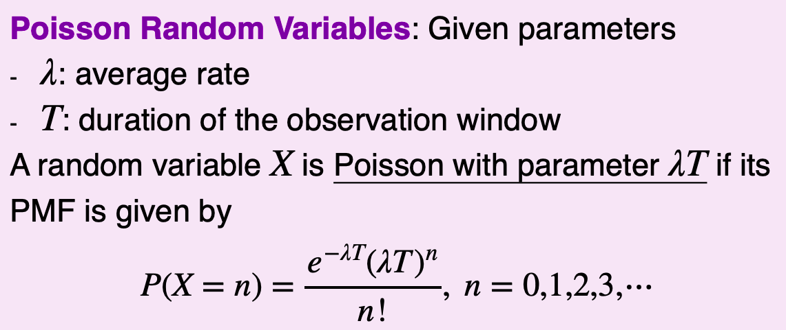
       - 由Binomial推導
         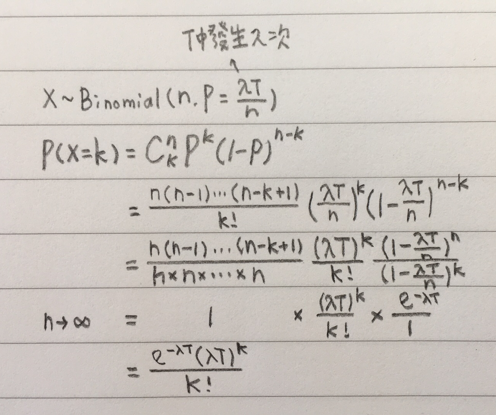
       - $k = \lambda T, P(x = k)$有最大值
    4. Geometric r.v.: 做多次Bernoulli，在第k次第一次成功
       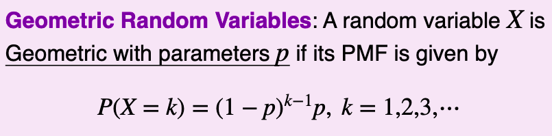
       - Memoryless Property: $P(X = n + m | X > m) = P(n)$
    5. Discrete Uniform r.v.: 1 experiment with n equally-likely outcome
       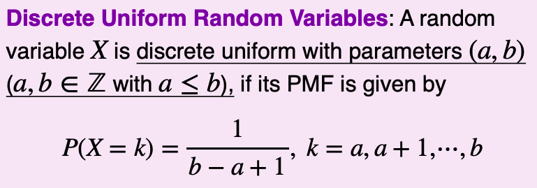
  - Continuous Random Variables
    1. Probability Density Function (PDF)
       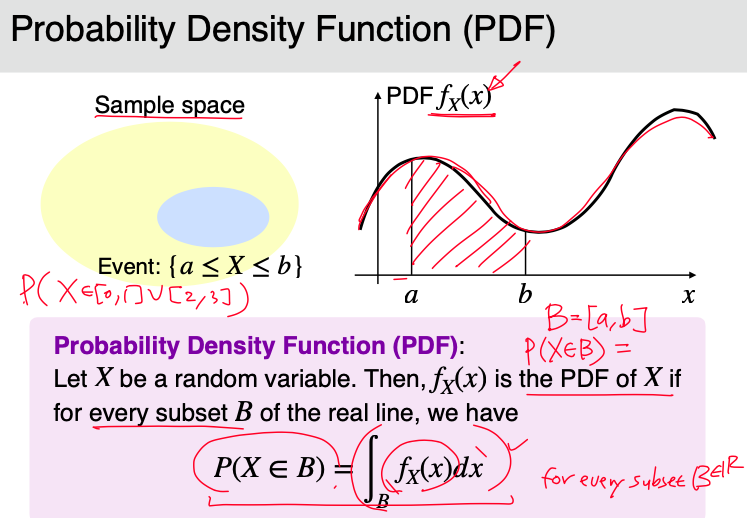
       - 3 Axiom
         1. $P(x \in R) = 1$
         2. $P(x \in A) \geq 0$
         3. $A_1,\ A_2, ...$ are mutually exclusive
            $P(x \in \cup_{i \geq 1} A) = \Sigma_{i \geq 1} P(x \in A_i)$
       - CDF 轉換 PDF
         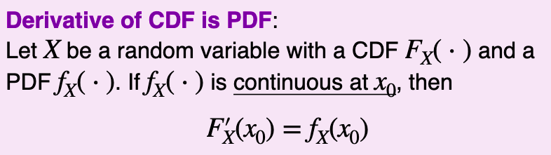
         注意PDF需要連續，參照反例
         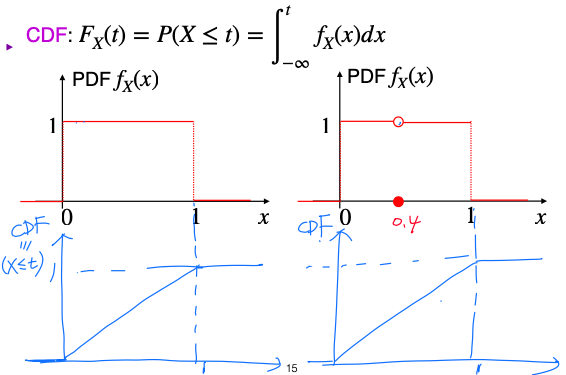
- Expected Value 期望值
  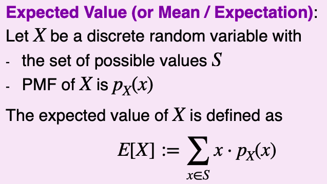
  - 另一種期望值的表示方式
    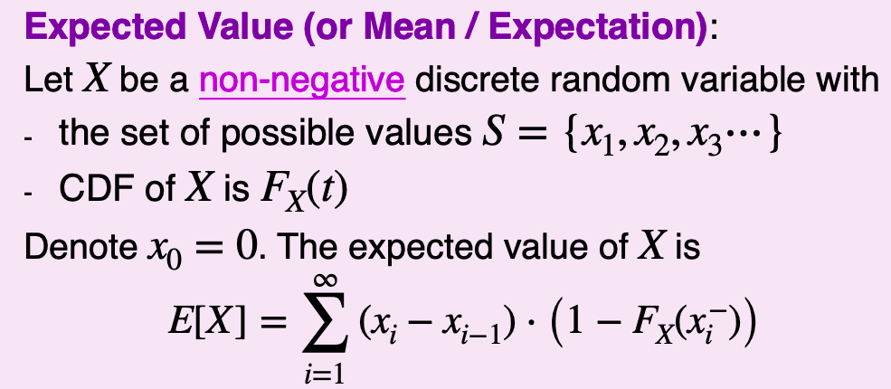
  - Law of the unconscious statistician (LOTUS)
    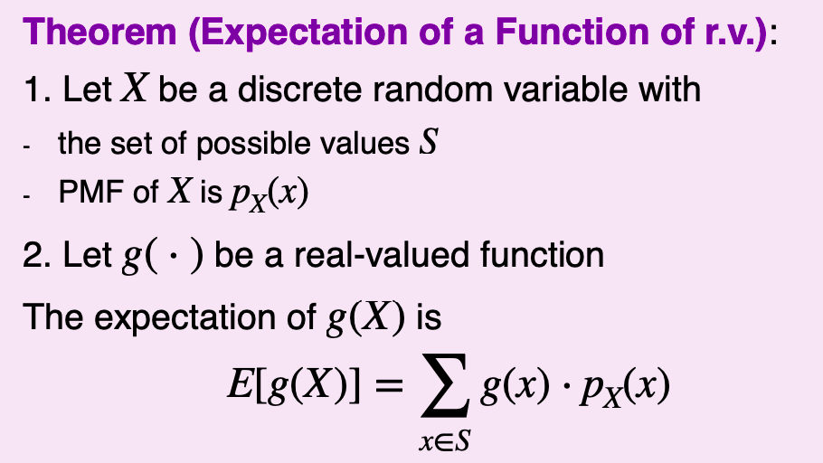
  - 期望值可做線性拆解
    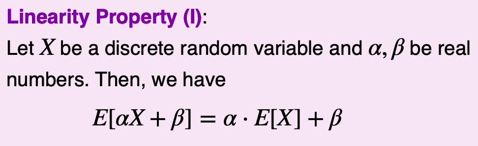
    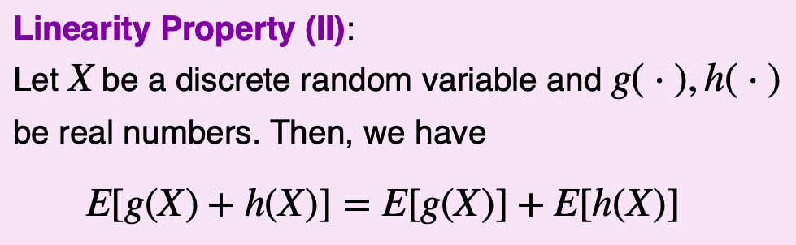
  - 條件期望值
    
- Variance 變異數
  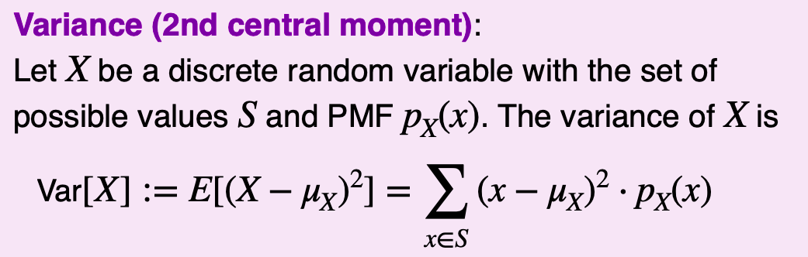
  - LOTUS with $g(x) = (x - \mu_x)^2
  - 減掉期望值，回歸0，平方消除正負差異
  - 公式
    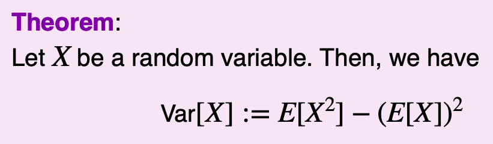
    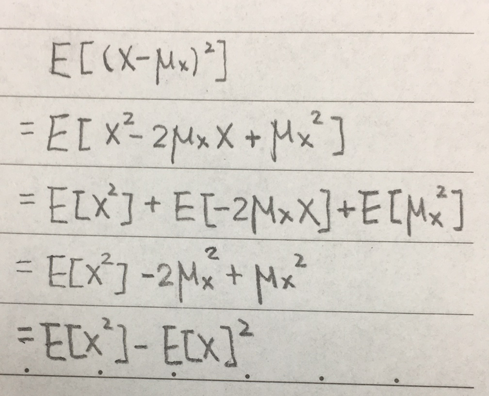
  - Riemann Rearrangement Theorem
    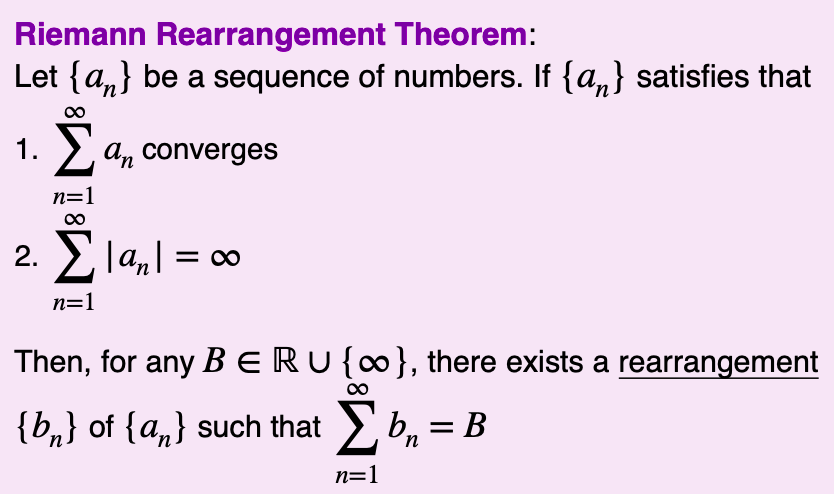
    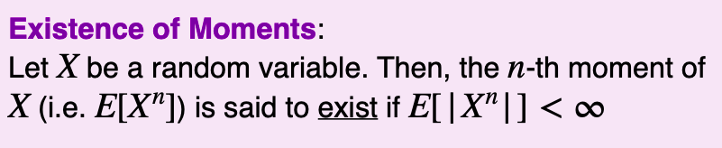
  - 特殊離散r.v.的期望值
    1. X ~ Bernoulli(p)
       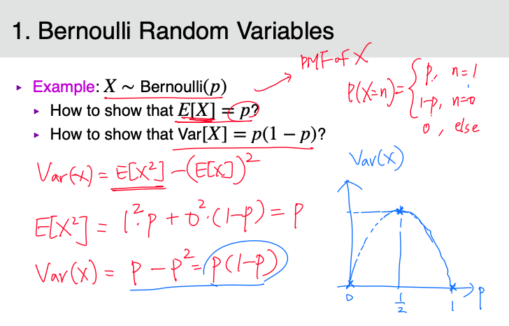
    2. X ~ Binomial(n, p)
       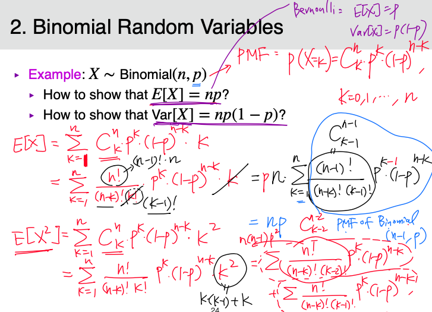

       

    
       

