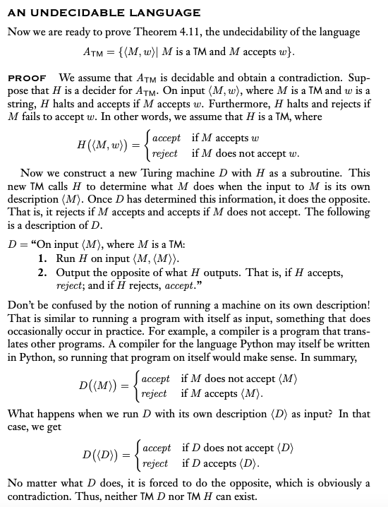
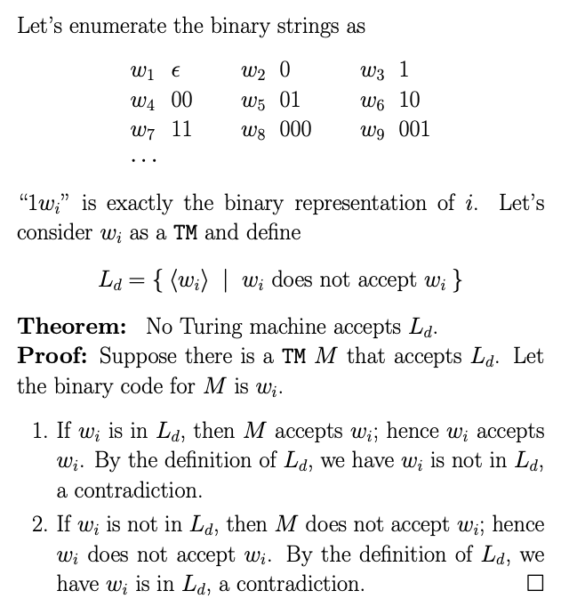
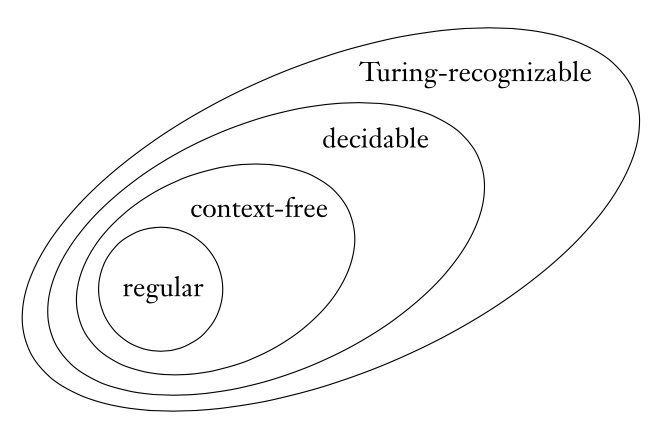

### 4.2 Undecidable Problem and Turing-recognizable language 非決定性問題與圖靈可識別語言

- 非決定性問題：停機問題為非決定性問題
  - $A_{TM} = \{ ⟨M,w⟩\ |\ M\ is\ a\ TM\ that\ accepts\ w \}$
    1. 直觀想像：給予一個程式，要求判斷是否結束運行，若已經結束，則顯然會結束運行，若不結束，則難以辨別會在遙遠的未來結束，抑或永遠不停機
    2. 證明停機問題為Turing-recognizable（論證recognize > decidable）

       
    
    3. 證明停機問題為非決定性問題（利用反證法證明）
       1. 假設$halt(f)$可判別$f$是否停機，停機回傳1，不停機回傳0
       2. 建構$modifyHalt(f)$，如果$f$停機則進入死循環，反之停機
          ```c++
          void modifyHalt (char* f) {
              if (halt(f))
                  while (1) {} // 死循環
              else
                  return; // 停機
          }
          ```
       3. 將$modifyHalt$作為自己的輸入，可得到矛盾（根據程式邏輯，若停機則內部不停機，若不停機則內部停機）
       - 嚴格證明

         
    
       - 停機問題的證明核心在於自我指涉，類似問題還有全能悖論、理發師悖論等

- 集合大小的討論
  - 有限集合：可直接計算決定
  - 無限集合：若有兩個集合可一一配對，則有相同大小
    1. one-to-one: $$x \neq y\ iff\ f(x) \neq f(y)$$
    2. onto: $$\forall b \in B,\ exists\ a \in A, f(a) = b$$
    3. correspondence (same size): $$f: A \rightarrow B\ is\ one-on-one\ and\ onto$$

- Diagonalization Method 對角線法（判斷無限集合大小）
  - R is uncountable: 假設f(n)是自然數對應實數的函數，其必定不包含對角線更改而成的數字，因此矛盾
  - Turing-recognizable language: 圖靈機可視為一個字串，所有圖靈機可是為字串的集合(countable)，可用對角線法證明存在不屬於Turing-recognizable的語言

- 圖靈可識別語言
  - co-Turing-recognizable: 當給予一個錯誤的輸入時，圖靈機可識別，反之不行，是Turing-recognizable的complement
  - 一語言$decidable$若且唯若$Turing-recognizable$ and $co-Turing-recognizable$
    1. 換言之，如果一語言和其補集同時為$Turing-recognizable$，該語言為$decidable$
    2. 證明

       

  - 停機問題的補語言是圖靈不可識別語言

    

  - 另一個不可識別的例子

    

- 各關係整理

  

