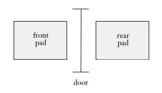
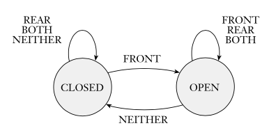
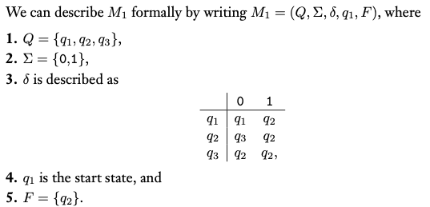

### 1.1 Finite Automata 有限自動機

- 介紹：
  - 有限自動機可以看成一種模型，用以描述記憶體有限的計算機（僅紀錄狀態及少數轉移條件）
  - 常用state diagram或transition table表示
  - 有限指的是狀態（或換言之，記憶體）有限，輸入可以無限長
  - 例子：自動門

  
  

- 定義：一個有限自動機是5-tuple($Q, \Sigma, \delta, q_0, F$)
  1. $Q$: $states$，狀態集合
  2. $\Sigma$: $alphabet$，字母集合
  3. $\delta$: $Q \times \Sigma \rightarrow Q$，$transition\ function$，轉移函式
  4. $q_0 \in Q$: 起始狀態
  5. $F ⊆ Q$: $accept\ state$跟$final\ state$，接受狀態集合
  - 圖解：

  
  

- 如果一系列狀態$r_0, r_1, ..., r_n \in Q$符合下列條件，則稱此有限自動機$M = (Q, \Sigma, \delta, q_0, F)$ accept（接受）字串$w_1w_2......w_n$
  1. $r_0 = q_0$，機器$M$從起始狀態出發
  2. $\delta(r_i, w_{i + 1}) = r_{i + 1}, \forall i = 0, . . . , n − 1$，機器$M$根據轉移函式轉移狀態
  3. $r_n \in F$，機器$M$最後停在接受狀態
 
 - 相關專有名詞：
   - Language 語言
     - $L(A) = M$，Language $A$為所有機器$M$接受字串的集合
     - 一個機器只會對應一種語言
   - Recognize 辨識
     - $M$ recognizes $A$，Language $A$中所有的字串都被$M$接受
     - Language是集合，用recognize，String是單個字串，用accept
   - Regular Language 正規語言 : 一種語言能夠由某個有限狀態機辨識，則為正規語言
 
- The Regular Operations 正規運算子
  - 聯集 Union: $A \bigcup B = \{x\ |\ x \in A\ or\ x \in B\}$
  - 字串串接 Concatenation: $A \circ B = \{xy\ |\ x \in A\ and\ y \in B\}$
  - Star: $A^* = \{x_1x_2...x_n\ |\ k \geq 0\ and\ each\ x_i \in A\}$
    - $\epsilon$代表空字串(empty string) $\epsilon \in A^*$
    - 字串隨意串接n次
  - The class of regular languages is closed（封閉性） under 
    - the **union** operation.
    - the **concatenation** operation.