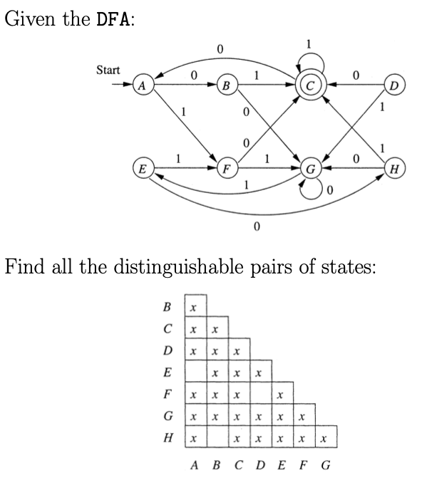

### 1.6 Myhill-Nerode Theorem & Minimization of DFAs

- Indistinguishable 不可區分
  - 定義：
    - 給定一個字母集$\Sigma$，與其生成的語言$L \subseteq \Sigma^*$
    - 給定兩字串$x, y \in \Sigma^*$
    - 若對所有後綴字串$z \in \Sigma^*$，$xz,\ yz$同時屬於或不屬於$L$，則此兩字串稱為不可區分，反之可區分
  - 性質：
    - 不可區分為等價關係，具備等價關係性質
      1. Reflexive
      2. Symmetric
      3. Transitive
    - 以自動機來看，一組等價的字串對應DFA上的一個狀態

    

- Myhill-Nerode Theorem
  - $L$為正規語言，若且唯若$\equiv_L$的等價類數目是有限的
  - 接受語言$L$的最小自動機狀態數目等於$\equiv_L$的等價類數目
  - 證明：
    1. 若$\equiv_L$數目無限，則語言$L$必不正規：
        - 鴿籠原理證DFA數目不小於等價類數
        - 若等價類數無限代表DFA狀態無限，與有限狀態機相悖
    2. 若$\equiv_L$數目有限，則必有DFA接受語言$L$：
        - 顯然可得

- 與泵定理不同，Myhill-Nerode Theorem為正規語言的充要條件

- Minimization of DFAs 最小化有限狀態自動機
  - 等價狀態：$δ(p, w) \in F \leftrightarrow δ(q, w) \in F,\ for\ all\ w \in \Sigma^*$，則$p, q$等價
  - Table-filling Algorithm
    - 找出可區別的狀態，再透過此狀態，找出其他可區別狀態（部分歸納思想）

    

    - 實作可用queue
    - 化簡圖解：
    
    

    - 化簡結果：
    
    
  
  