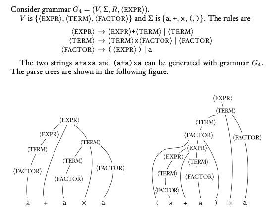
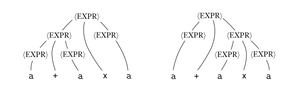

### 2.1 Context-Free Grammar (CFGs)

- CFGs 上下文無關語言
  - 定義：CFGs是4-tuple($V, \Sigma, R, S$)
    1. $V$: $variables$，狀態集合
    2. $\Sigma$: $terminal$，結束狀態集合，與$V$不相交
    3. $R$: $productions$，轉移函式
       - $head$: 一個$V$中的變數
       - $\rightarrow$: 轉移
       - $body$: $\{s\ |\ s \in (V \cup \Sigma)^*\}$
       - 範例：$a \rightarrow b$，$a$是$head$，$b$是$body$
    4. $S$: 起始狀態集合，$S \in V$
  - 名詞解釋：
    1. $productions$: $A \rightarrow w$
    2. $derive$: $u \overset{*}{\Rightarrow} v$，由0到多次轉移得到的關係（星號可視為$Kleene\ Star$）

- CFGs Language為$\{w \in \Sigma^* \ | \ S \overset{*}{\Rightarrow} w\}$
  - 由初始狀態按規則代換，直到全部都為$terminal$
  - 圖解：
    - 可用parse tree表示

    

- Ambiguous Grammar 曖昧文法
  - 如果一字串$w$有兩個或兩個以上的leftmost derivations，則稱為ambiguous
  - 換言之，一個字串可畫出超過一個parse tree，即為ambiguous
  - inherently ambiguous: 僅能用ambiguous grammar表示的文法
  - 圖解：

  

