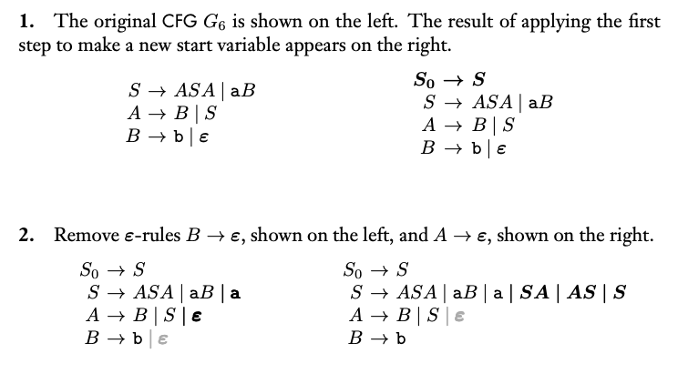
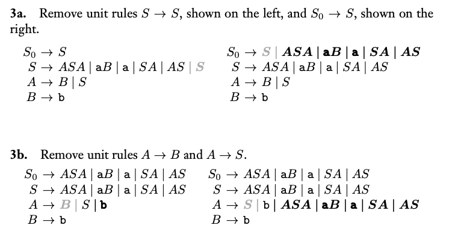

### 2.2 Chomsky Normal Form

- 用以簡化CFGs，所有的Chomsky範式都是CFGs，所有的CFGs也都可以簡化成Chomsky範式

- 定義：
  1. $A \rightarrow a$，一個變數轉換一個結束符號
  2. $A \rightarrow BC$，一個變數轉換成兩個變數（不為起始變數）
  3. $S \rightarrow \epsilon$，起始變數轉換成空字串（原語言包含空字串）

- 轉換流程：
  1. 加入ㄧ新狀態$S_0 \rightarrow S$，$S$為原本起始狀態
     - 此轉換保證起始狀態不在$rule$右側
  2. 處理空字串，將所有空字串化簡
  3. 處理unit rules
  4. 轉換成符合定義形式（兩個變數 or 一個結束符號）

- 圖解：

