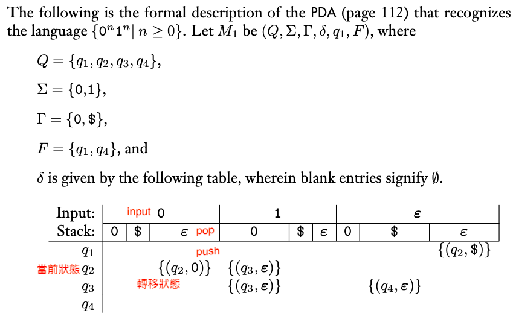

### 2.3 Pushdown Automata 下推自動機

- PDA 下推自動機
  - 定義：PDAs是6-tuple($Q, \Sigma, \Gamma, \delta, q_0, F$)
    1. $Q$: $states$，狀態集合
    2. $\Sigma$: $alphabet$，字母集合
    3. $\Gamma$: $stack$，堆疊
    4. $\delta$: $Q \times \Sigma_\epsilon \times \Gamma_\epsilon \rightarrow P(Q \times \Gamma_\epsilon)$，$transition\ function$，轉移函式
    5. $q_0 \in Q$: 起始狀態
    6. $F \subseteq Q$: $accept\ state$跟$final\ state$，接受狀態集合
  - accept:
    1. 圖解：

    

    2. $r, s, ｗ$分別為狀態、堆疊、輸入，若轉移最終可到終止狀態，則accept
    3. $ \$ $用來標示empty stack
  - 下推自動機表示法：
    1. 表格表示：

    

    2. 圖形表示：

    

- CFGs跟PDAs必等價
  - CFGs to PDAs:
    1. 對於$q_{start}$，先壓入$ \$ $，以便辨別是否清空
    2. 壓入$S$，起始狀態
    3. 對於堆疊頂端元素，如果為$terminal$，讀入該字元，可直接轉為空字串
    4. 對於堆疊頂端元素，如果為變數，轉為對應的$word$

    

    - 圖例：
      1. 注意推入$w$時，要反序推入，順序才是對的

    

  - PDAs to CFGs:
    1. 先將CFGs轉換成固定的Framework
       - 有一個accept state，$q_{accept}$
       - accept state前清空堆疊
       - 每個轉移有一個push或pop，不同時出現
    2. 對應PDA $P = (Q, \Sigma, \Gamma, \delta, q_0, F)$，構造CFG $C = (V, \Sigma, R, S)$
       - $V = \{A_{pq}\ |\ p, q \in Q\}$
       - $S = A_{{q_{0}, q_{accept}}}$
       - 有三類轉移關係$R$:
         1. $A_{pp} \rightarrow \epsilon$
         2. $A_{pq} \rightarrow A_{pr}A_{rq}$
         3. $A_{pq} = aA_{rs}b$
         - $p, q, r, s \in Q$，$t \in \Gamma$，$a, b \in \Sigma_{\epsilon}$
         - $(r, t) \in \delta (p, a, \epsilon)$且$(q, \epsilon) \in \delta (s, b, t)$
    3. 圖例：

    
    

    4. 根據定義，可發現若是$A_{pq}$產生$x$，則$p$到$q$間產生的堆疊為空（可參考圖解）
       - 歸納法證明，分項討論

       
       
    
    5. CFL是regular language的母集

