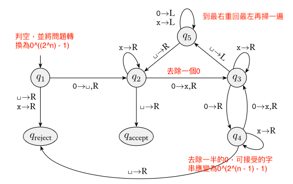
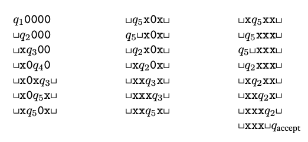
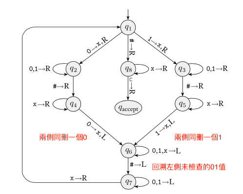

### 3.1 Turing Machines 圖靈機

- 圖靈機
  - 意義：圖靈機的基本思想在於模擬人類的運算，在模型內，圖靈機把運算過程簡化成兩個步驟
    - 圖靈機具有有限次操作及無限的紙帶長度（記憶體）
    1. 依據當前狀態以及紙帶上指向的值決策向左向右移（依據先前結果運算）
    2. 在紙帶上修改剛才的值（改變記憶體）
    
  - 定義：圖靈機是7-tuple($Q, \Sigma, \Gamma, \delta, q_0, q_{accept}, q_{reject}$)
    1. $Q$: $states$，狀態集合
    2. $\Sigma$: $alphabet$，字母集合，不包含空$\sqcup$
    3. $\Gamma$: 紙帶，$\sqcup \in \Gamma \ and\ \Sigma \subseteq \Gamma$，紙帶上預設全部為空（表示未寫）
    4. $\delta$: $Q \times \Gamma \rightarrow Q \times \Gamma \times \{L,\ R\}$
    5. $q_0 \in Q$: 起始狀態
    6. $q_{accept} \in Q$: 接受狀態
    7. $q_{reject} \in Q$: 拒絕狀態

  - 圖靈機的組態 Configuration
    1. 現在的狀態
    2. 現在紙帶的內容
    3. head location
    - 特殊組態

      

  - 標頭指向紙帶位置（狀態右側的字符）

    
  
  - 圖靈機的轉移（組態轉移）：$C_1$ yields $C_2$
    1. $uaq_ibv$ yields $uq_jacv$
       $if\ \delta(q_i, b) = (q_j, c, L)$
    2. $uaq_ibv$ yields $uacq_jv$
       $if\ \delta(q_i, b) = (q_j, c, R)$
  
  - 範例
    1. $A = \{0^{2^n} | n \geq 0\}$

       
    
    2. $A$輸入0000的狀況

       
    
    3. $B = \{w \sharp w | w \in \{0, 1\}^*\}$

       
  
  - TM accept input $w$
    - 存在$C_1, C_2, ..., C_k$
    1. $C_1$是起始組態
    2. $C_i\ yields\ C_{i + 1}$
    3. $C_k$是接受組態
  
  - 所有被TM $M$接受的字串
    = The language of $M$
    = The language $recognized$ by $M$
    = $L(M)$
  
  - Recognizable & Decidable
    1. Turing-recognizable: 語言可被某TM recognizes
       （recognize的意思是正確input會accept，錯的可能reject一直跑下去）
    2. Turing-decidable: 語言可被某TM decides，也稱為recursively enumerable language
       （decide的意思是正確input會accept，錯的會reject，不會一直跑下去）
    
    
       
    

    

