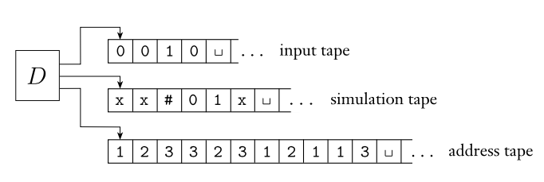

### 3.2 Variants of Turing Machines 變形圖靈機

- Multitape Turing Machines 多帶圖靈機
  - k-tape TM:
    - $\delta: Q \times \Gamma^k \rightarrow Q \times \Gamma^k \times \{L, R, S\}$
    - $\delta(q, x_1, x_2, ..., x_k) = (q^{'}, x_1^{'}, x_2^{'}, ..., x_k^{'}, m_1, m_2, ..., m_k), m \in \{L, R\}$
    1. L: 左移
    2. R: 右移
    3. S: 保持原位

- 多帶圖靈機跟單帶圖靈機等價
  - 單帶 to 多帶：更改型別即可
  - 多帶 to 單帶
    - 用單帶模擬多帶行為
    - 將多帶上的內容合併成單帶，不同紙帶用#分離（指針位址用點表示）
    1. 掃第一遍確認儲存內容（指針位置）
    2. 掃第二遍轉移（若指針移到#上，則補上blank後全部右移）

       

  - 一種語言為Turing-recognizable iff 某種多帶圖靈機可辨識該語言

- Nondeterministic Turing Machines 非決定性圖靈機
  - $\delta: Q \times \Gamma \rightarrow P(Q \times \Gamma \times \{L, R\})$

- 決定性圖靈機與非決定性圖靈機等價
  - 決定性 to 非決定性：更改型別即可
  - 非決定性 to 決定性
    - 非決定性圖靈機對於input $w$，其結果可視為一個tree（每個轉移有多種選擇），因此可用遍歷所有可能，來檢查是否接受此輸入
    - 如果直接用dfs，可能會在某種選擇下陷入當機，即使其他branch有解，也無法遍歷到，因此須結合bfs的概念，做ids(iterative deeping search)
    - 可對任意非決定性圖靈機$N$，建構決定性圖靈機$D$，做如下操作
      1. 令k = 1
      2. dfs $N$每個分支的計算，但僅做到k步（避免當機），若在k步內停機，則輸出結果
      3. k++，回到步驟1

    
    - 圖例解釋（圖為建構的決定性圖靈機，有三紙帶）
      1. input存於tape 1，不會更改
      2. tape 2複製tape 1，紀錄當前模擬結果
      3. tape 3紀錄選擇（樹上哪個分支）

- Enumerators
  - 沒有input，枚舉字串
  - 不按字典序，也可能重複
  - Turing-recognizable iff 有enumerator枚舉出該語言（遞歸可枚舉語言）

- Turing-recognizable語言與遞歸可枚舉語言等價
  - enumerator to TM
    1. 枚舉生成的字串與input $w$比較，若相同則接受
  - TM to enumerator
    1. enumerator $E$忽略輸入
    2. 以$s_1, s_2, ..., s_i$在TM上跑$i$步，若接受則將其輸出
    3. $i$起始為1，慢慢增加（避免當機）