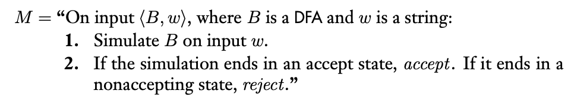
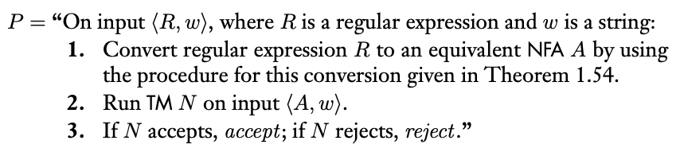
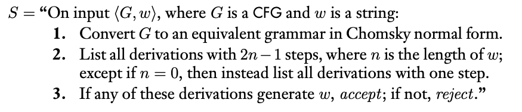
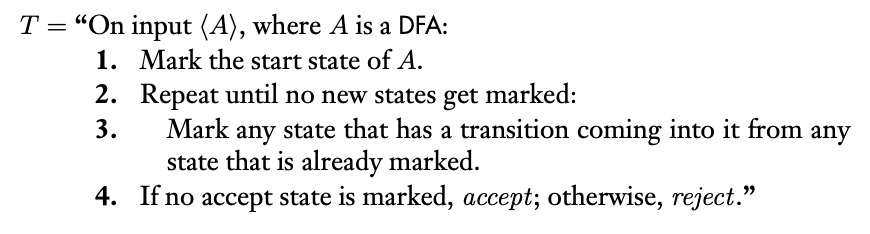
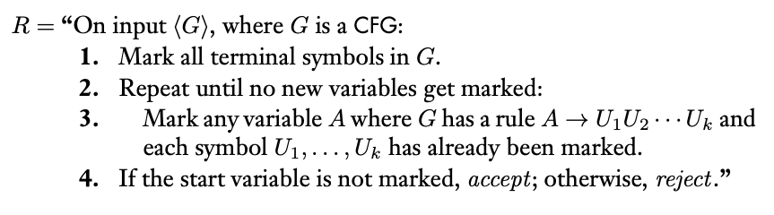
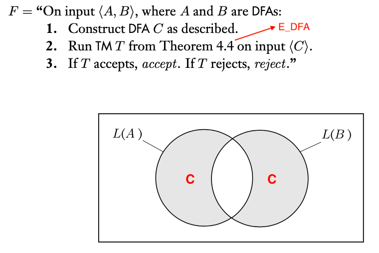

### 4.1 Decidability 決定性問題

- 決定性問題
  - 定義：決定性問題是一個在某些形式系統回答是或否的問題（白話來說，可回答yes or no）
  - 例子：「給兩個數字x與y，x是否可以整除y？」此問題可回答是或否，且依據其x與y的值

- 圖靈決定性語言
  - 定義：設$S \subseteq \Sigma^* $為一種語言，若存在任意圖靈機$M$對任意字串$w \in \Sigma^* $，符合下列條件，則該語言稱為圖靈決定性語言
    1. $w \in S,\ iff\ M\ accept\ w$
    2. $w \notin S,\ iff\ M\ reject\ w$

- 決定性問題相關討論
  - A: accept，自動機是否接受特定字串
  - E: empty，自動機是否不接受任何字串
  - EQ: equal，兩自動機是否相等

- Accept: $A_{DFA}, A_{NFA}, A_{REX}, A_{CFG}$為決定性語言
  - $A_{DFA} = \{ ⟨B, w⟩\ |\ B\ is\ a\ DFA\ that\ accepts\ string\ w\}$

    
    
    1. DFA不難用圖靈機模擬（紙帶可紀錄狀態和input位置）
    2. 輸入有限，模擬完必為接受或不接受，故$A_{DFA}$為決定性問題
  - $A_{DFA}$可決定，NFA、RE皆與其等價，亦為決定性語言（證明先轉成DFA，再模擬）
  - $A_{NFA} = \{ ⟨B, w⟩\ |\ B\ is\ a\ NFA\ that\ accepts\ string\ w\}$
    
    

  - $A_{REX} = \{ ⟨R, w⟩\ |\ R\ is\ a\ regular\ expression\ that\ generates\ string\ w\}$
   
    

  - $A_{CFG} = \{ ⟨G, w⟩\ |\ G\ is\ a\ CFG\ that\ generates\ string\ w\}$

    

    1. 輸入長度為n，則Chomsky做(2n - 1)次操作，可找到該字串
    2. 一次操作可增加/減少一個變數，做(n - 1)次增長，n次轉移至終止符號
    3. 枚舉所有可能的字串，若$w$在其中，則接受，反之不接受

  - 所有CFL皆可決定

    

    1. 對於CFL Ａ，可得其文法CFG G，可對輸入建立$A_{CFG}⟨G, w⟩$，若接受則接受，反之亦然

- Empty: $E_{DFA}, E_{CFG}$為決定性語言
  - $E_{DFA} = \{ ⟨A⟩\ |\ A\ is\ a\ DFA\ and\ L(A) = \text{\O} \}$

    

    1. 標記起始狀態，標記所有可到達的狀態，看是否能標記到接受狀態
    2. 狀態有限，且不需重複標注，因此不必考慮標不完或陷入迴圈的狀況

  - $E_{CFG} = \{ ⟨G⟩\ |\ G\ is\ a\ CFG\ and\ L(G) = \text{\O} \}$

    

    1. 不像DFA標記起始狀態，因為變數可轉移為變數，可能結果無限多，不可能做完
    2. 標記終止狀態，慢慢回推（近似CYK），若可推回起始狀態，則不接受，反之接受

- Equal:  $EQ_{DFA}$為決定性語言，$EQ_{CFG}$為非決定性語言
  - $EQ_{DFA} = \{ ⟨A, B⟩\ |\ A\ and\ B\ are\ DFAs\ and\ L(A) = L(B) \}$

    

    1. 運用DFA的封閉性，可得到C
    2. 可透過$E_{DFA}$檢測C，若接受（C為空），則A, B等價

  - $EQ_{CFG} = \{ ⟨G,H⟩\ |\ G\ and\ H\ are\ CFGs\ and\ L(G) = L(H) \}$
    1. $EQ_{CFG}$為非決定性語言，證明見第五章