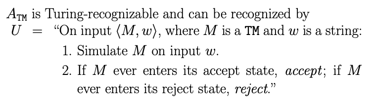
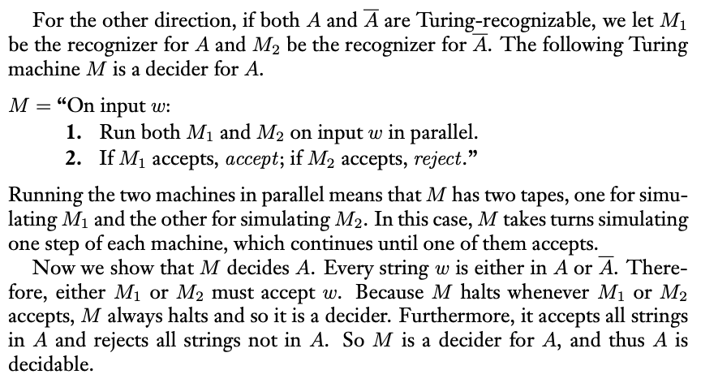
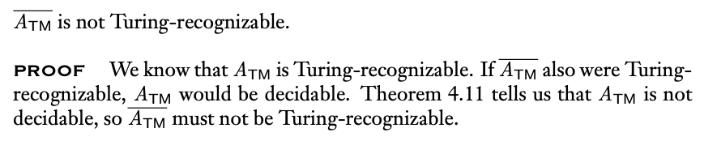

### 4.2 Undecidable Problem and Turing-recognizable language 非決定性問題與圖靈可識別語言

- 非決定性問題：停機問題為非決定性問題
  - $A_{TM} = \{ ⟨M,w⟩\ |\ M\ is\ a\ TM\ that\ accepts\ w \}$
    1. 證$A_{TM}$為Turing-recognizable（論證recognize > decidable）

       
    
    3. 證明$A_{TM}$為非決定性問題（利用反證法證明）
       1. 假設$A_{TM}$為決定性問題，假設$H(⟨M,w⟩)$可判別圖靈機對特定輸入是否接受，接受回傳1，不接受回傳0
       2. 建構$D(⟨M⟩)$，如果$M$接受自身則拒絕，反之接受
          ```c++
          void D (char* M) {
              if (H(⟨M, ⟨M⟩⟩) == 1)
                  return 0;
              else
                  return 1;
          }
          ```
        3. $D(⟨D⟩)$矛盾
       - 嚴格證明

         
    
       - $A_{TM}$的證明核心在於自我指涉，類似問題還有全能悖論、理發師悖論等

- 集合大小的討論
  - 有限集合：可直接計算決定
  - 無限集合：若有兩個集合可一一配對，則有相同大小
    1. one-to-one: $$x \neq y\ iff\ f(x) \neq f(y)$$
    2. onto: $$\forall b \in B,\ exists\ a \in A, f(a) = b$$
    3. correspondence (same size): $$f: A \rightarrow B\ is\ one-on-one\ and\ onto$$

- Diagonalization Method 對角線法（判斷無限集合大小）
  - R is uncountable: 假設f(n)是自然數對應實數的函數，其必定不包含對角線更改而成的數字，因此矛盾
  - Turing-recognizable language: 圖靈機可視為一個字串，所有圖靈機可是為字串的集合(countable)，可用對角線法證明存在不屬於Turing-recognizable的語言

- 圖靈可識別語言
  - co-Turing-recognizable: 當給予一個錯誤的輸入時，圖靈機可識別，反之不行，是Turing-recognizable的complement
  - 一語言decidable若且唯若Turing-recognizable and co-Turing-recognizable
    1. 換言之，如果一語言和其補集同時為Turing-recognizable，該語言為decidable
    2. $A\ is\ decidable\ iff\ A,\ A'\ are\ recognizable$
    3. 證明

       

  - 停機問題的補語言是圖靈不可識別語言

    

  - 另一個不可識別的例子

    

- 各關係整理

  

  - 插集、補集在可決定語言中有封閉性，在可識別語言裡沒有封閉性
  

