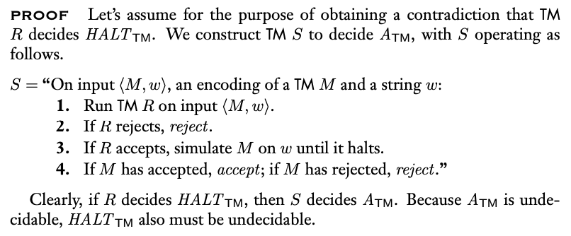
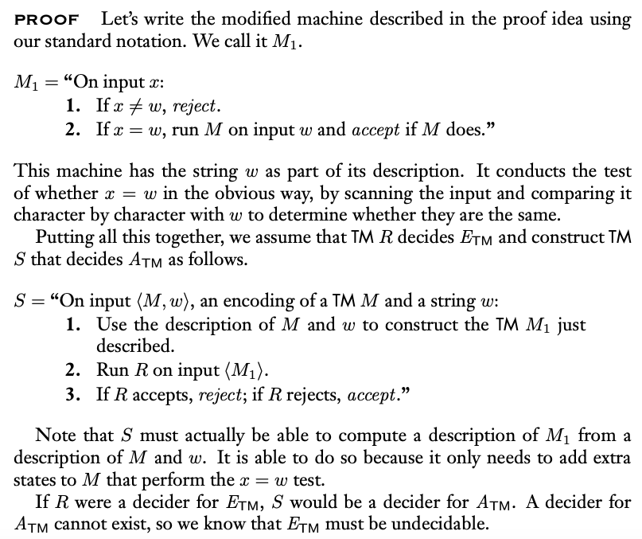
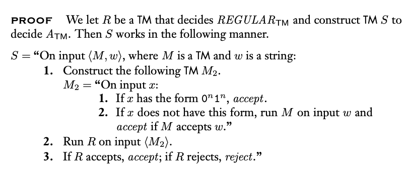
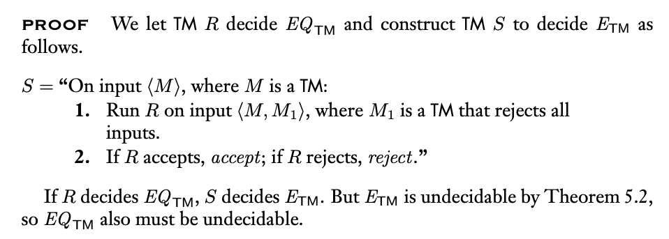
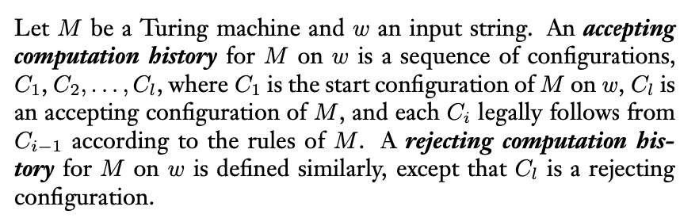
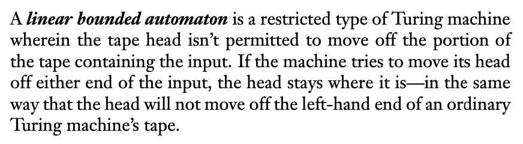
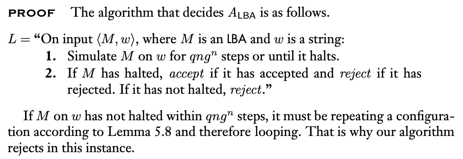
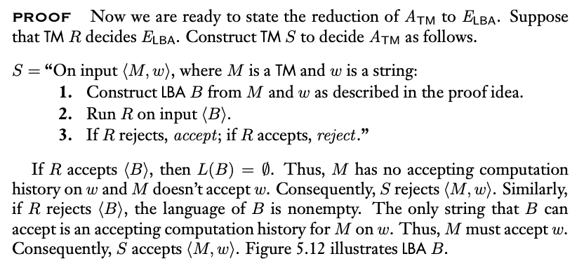
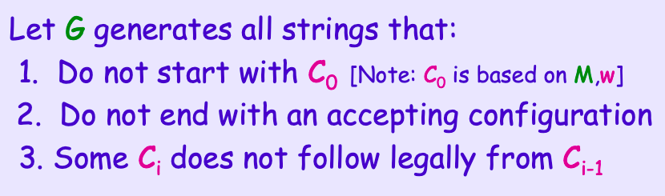
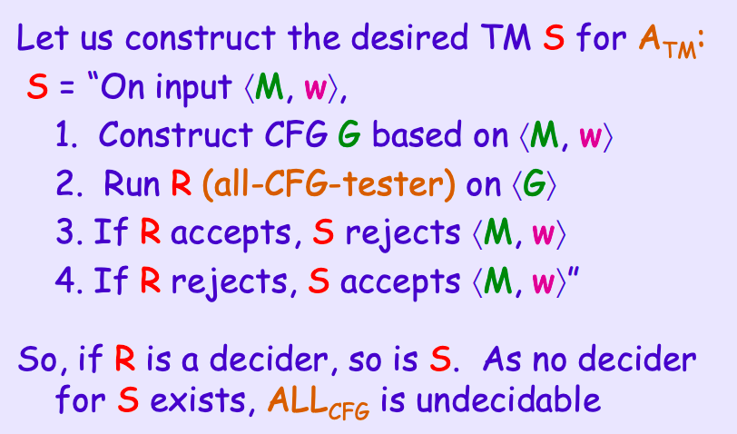

### 5.1 Reducibility 歸約性

- Reducible: A reduces B, A is easier than B
- 利用$A_{TM}$證明圖靈機不可決定
  - 先假設該機器可決定，再用其decider規約出不可決定的機器
  - $Halt_{TM}$
    1. 若不可同機則拒絕，可停機則模擬並輸出結果

    

  - $E_{TM}$
    1. 建構另一機器，拒絕除了輸入$w$所有字串，若輸入為$w$，則丟入原機器
    2. 將新建構的機器當作$E_{TM}$的輸入運行，若接受則代表原機器不接受輸入，輸出拒絕，反之同理

    

  - $REGULAR_{TM}$

    

  - $EQ_{TM}$
    1. 使用$EQ_{TM}$將圖靈機跟另一只拒絕的圖靈機比較，可得$E_{TM}$，$E_{TM}$不可決定

    

- Computation History
  
  

- linear bounded automaton

  

  - 限制紙帶（記憶體）大小的圖靈機，更貼近真實的計算機
  - $A_{DFA},\ A_{CFG},\ E_{DFA},\ E_{CFG}$可用$LBA$決定
  - 所有$CFL$可用$LBA$決定
  - $A_{LBA}$
    1. 全部的configuration只有有限種，因此模擬有限次，若還沒有有結果，則進入迴圈不會再有結果
       $$configuation = state \times head\ location \times tape$$
    
    
  
  - $E_{LBA}$
    1. 參考$E_{TM}$作法
    
    

- $ALL_{CFG}$
  - L(G)為所有可的字串去掉M對w的accepting history

  

  

  

